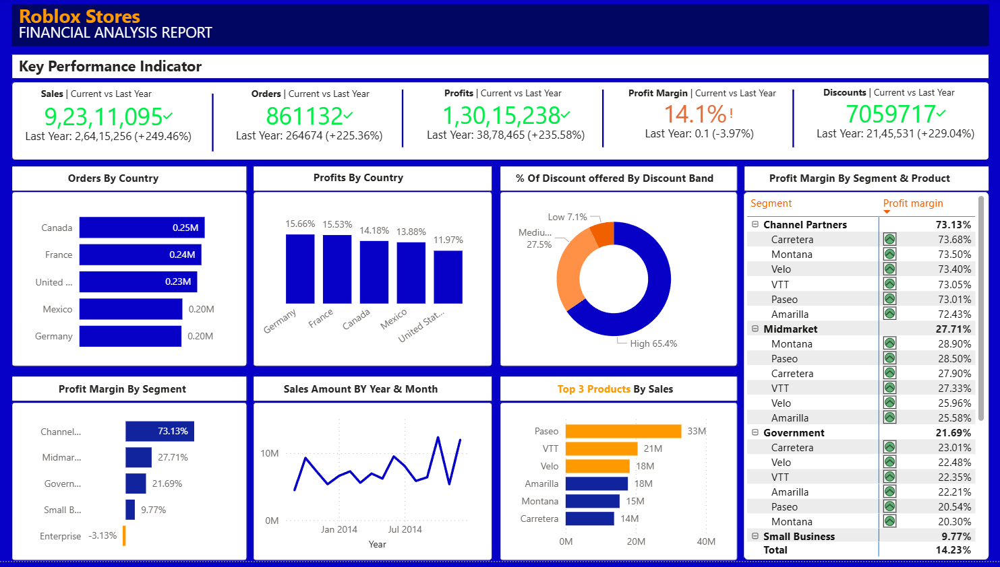

# 📊 Financial Analysis & Performance Dashboard

An interactive Business Intelligence dashboard developed in **Power BI** to analyze financial performance, profitability, sales trends, discounts, and business growth across multiple countries, products, and customer segments.

The dashboard provides executives and stakeholders with real-time insights into key financial metrics, enabling data-driven decision-making and performance monitoring.

---

## 🚀 Project Overview

This dashboard transforms raw financial data into actionable business insights through advanced data modeling, DAX calculations, KPI tracking, and interactive visualizations.

It helps answer critical business questions such as:

* Which countries generate the highest sales and profits?
* Which products contribute most to revenue?
* How do discounts impact profitability?
* Which customer segments have the highest profit margins?
* How has sales performance changed over time?

---

## 📸 Dashboard Preview

  

---

## 🎯 Business Objectives

* Monitor overall financial performance.
* Track sales, orders, profits, and profit margins.
* Analyze customer segment profitability.
* Identify top-performing products.
* Evaluate discount strategies.
* Compare year-over-year business growth.

---

## 📌 Key Performance Indicators (KPIs)

| KPI           | Description                     |
| ------------- | ------------------------------- |
| Sales         | Total revenue generated         |
| Orders        | Total number of customer orders |
| Profit        | Net profit earned               |
| Profit Margin | Percentage profitability        |
| Discounts     | Total discount offered          |

---

## 📊 Dashboard Features

### Executive KPI Summary

Provides a high-level overview of:

* Total Sales
* Total Orders
* Total Profit
* Profit Margin
* Discounts Offered

Along with year-over-year comparison metrics.

---

### Country-Wise Analysis

#### Sales by Country

Identifies top-performing countries by revenue.

#### Profit by Country

Highlights countries contributing the highest profits.

---

### Discount Analysis

Visualizes discount distribution across:

* High Discount Band
* Medium Discount Band
* Low Discount Band

Helps evaluate pricing and promotional strategies.

---

### Segment Performance Analysis

Analyzes profitability across:

* Channel Partners
* Midmarket
* Government
* Small Business
* Enterprise

Provides detailed product-level profit margin analysis.

---

### Sales Trend Analysis

Monthly sales trend visualization for:

* Revenue growth monitoring
* Seasonal trend identification
* Performance forecasting support

---

### Product Performance Analysis

Top-selling products based on:

* Revenue contribution
* Market demand
* Profitability

---

## 🛠️ Technology Stack

### Business Intelligence

* Power BI

### Data Transformation

* Power Query

### Data Modeling

* Star Schema Architecture
* Relationship Modeling

### Analytics

* DAX (Data Analysis Expressions)
* KPI Tracking
* Financial Analysis

### Visualization

* Interactive Dashboards
* Charts
* KPI Cards
* Drill-down Reports

---

## 📂 Dataset Information

The dashboard analyzes financial transactional data containing:

* Sales
* Orders
* Products
* Countries
* Customer Segments
* Discounts
* Profit Metrics

---

## 📈 Insights Generated

### Top Performing Countries

* Canada
* France
* United States
* Mexico
* Germany

### Most Profitable Segment

* Channel Partners

### Top Selling Products

* Paseo
* VTT
* Velo

### Discount Distribution

* High Discount Band contributes the largest share of discounts.

---

## 💡 Skills Demonstrated

* Business Intelligence
* Data Visualization
* Financial Analytics
* Power BI Development
* Data Modeling
* DAX Calculations
* KPI Design
* Dashboard Development
* Power Query ETL
* Business Reporting

---

## 🎓 Learning Outcomes

Through this project, I gained hands-on experience in:

* Building executive-level dashboards
* Designing KPI frameworks
* Implementing star schema models
* Writing advanced DAX measures
* Creating interactive reports
* Translating business requirements into analytical solutions

---

Skills:
Power BI • DAX • Power Query • Data Analytics • Business Intelligence • Dashboard Development

---

⭐ If you found this project useful, consider giving it a star.
